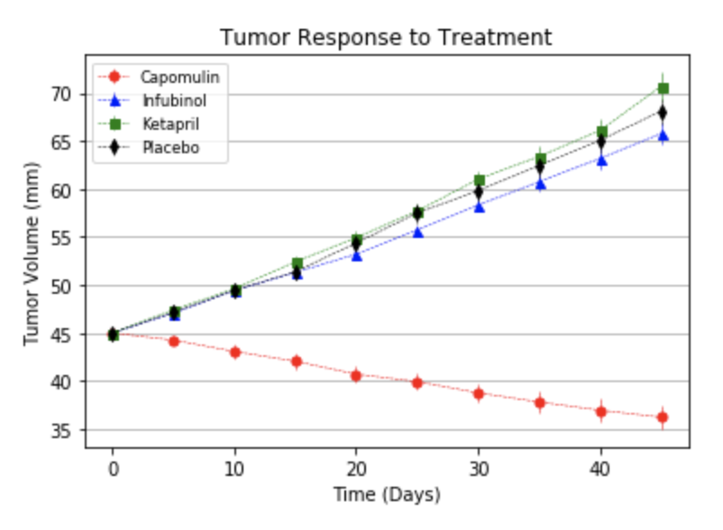
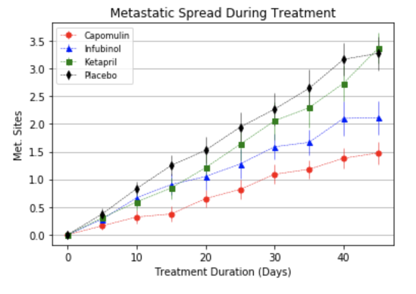
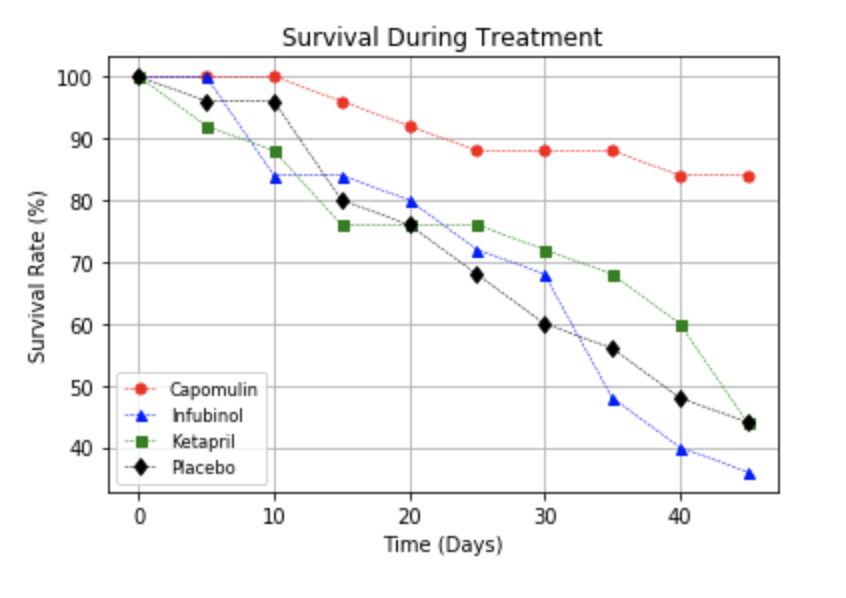
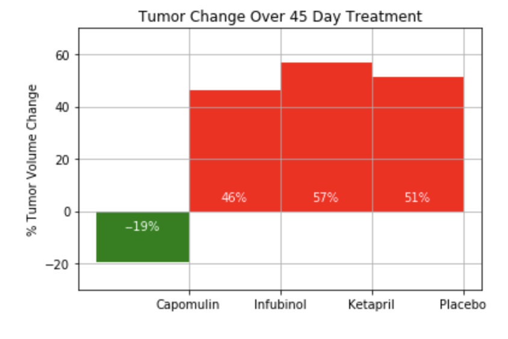

## The Power of Plots
I've joined Pymaceuticals Inc. as their acting Chief Data Analyst. Pymaceuticals specializes in drug-based, anti-cancer pharmaceuticals. In their most recent efforts, they’ve since begun screening for potential treatments to squamous cell carcinoma (SCC), a commonly occurring form of skin cancer.

I have access to the complete data from their most recent animal study. In this study, 250 mice were treated through a variety of drug regimes over the course of 45 days. Their physiological responses were then monitored over the course of that time. My objective is to analyze the data to show how four treatments (Capomulin, Infubinol, Ketapril, and Placebo) compare.

## Files
Clinical Trial Data:   
- Mouse ID
- Timepoint
- Tumor Volume (mm3)
- Metastatic Sites

Mouse Drug Data:   
- Mouse ID
- Drug

## Data Visualizations
Create a scatter plot to show how the tumor volume changes over time for each treatment  

Create a scatter plot that shows how the number of metastatic (cancer spreading) sites changes over time for each treatment  

Create a scatter plot that shows the number of mice still alive through the course of treatment (Survival Rate)  

Create a bar graph that compares the total % tumor volume change for each drug across the full 45 days  
  

## Analysis
After the 45 days of treatment, mice that were treated with Capomulin showed the most decrease in tumor volume (19% decrease) while the other treatments showed an increase in tumor volume. 

Mice that were treated with Ketapril had the largest metastatic spread after the 45 days   

Infubinol had a survival rate of below 40% (even lower than the survival rate for the placebo) after the 45 day span

## Tools
For this project, I used the following tools:  
- Pandas
- Matplotlib
- NumPy
